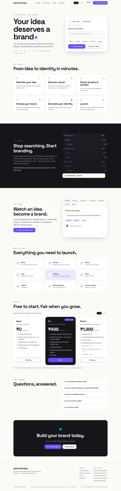
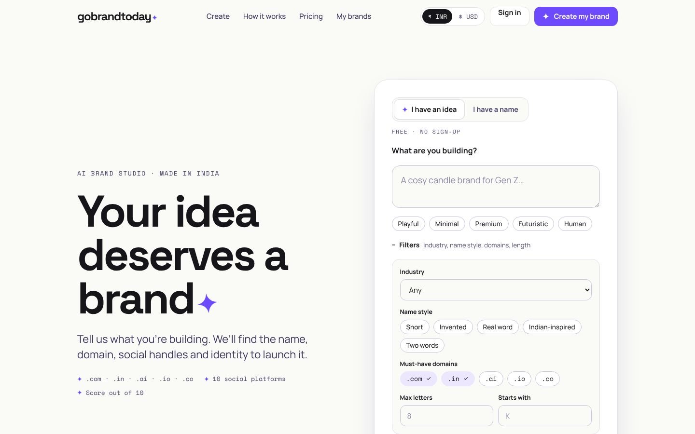
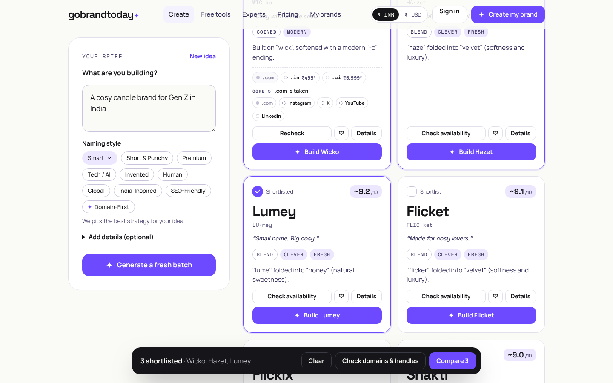
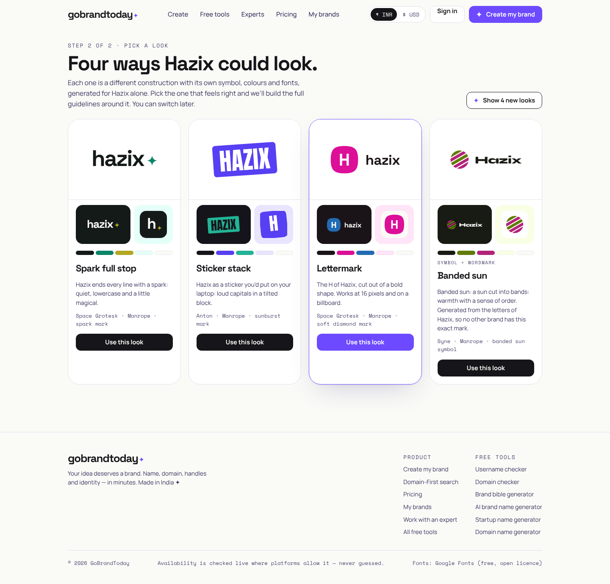
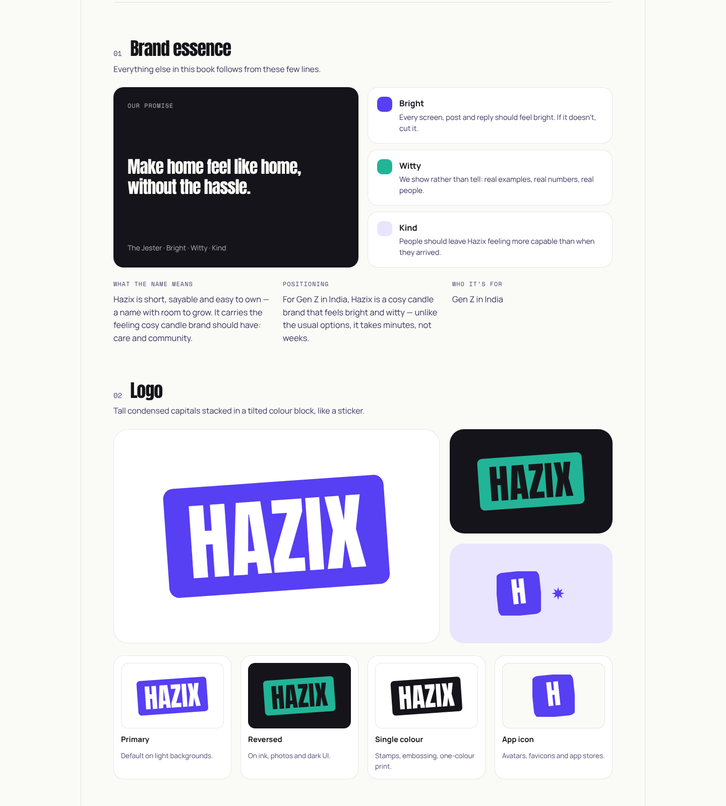
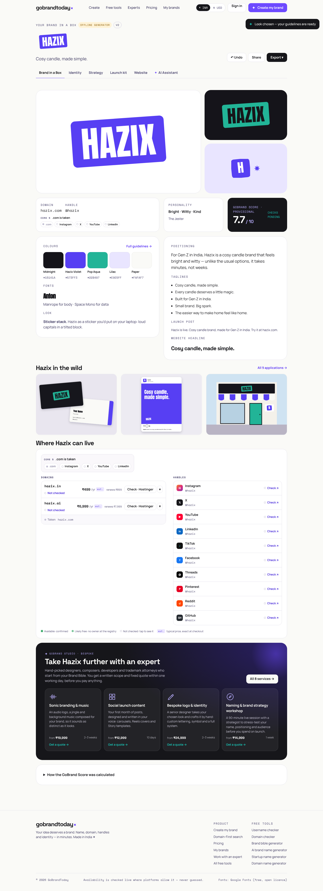
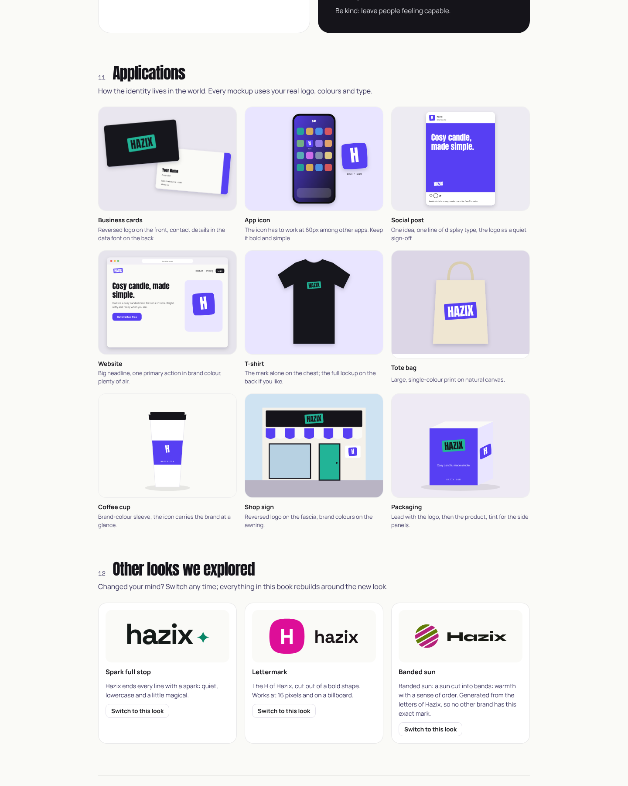
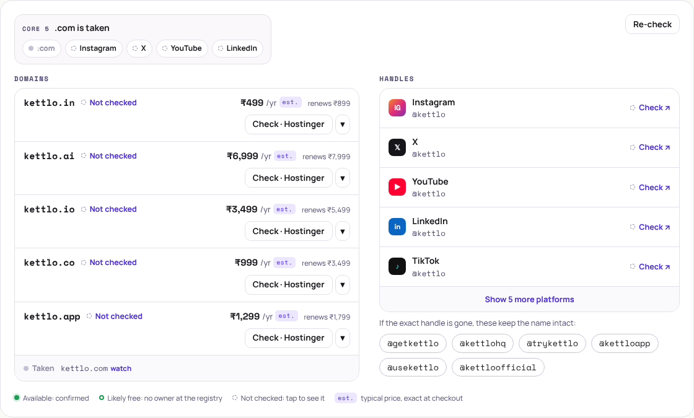
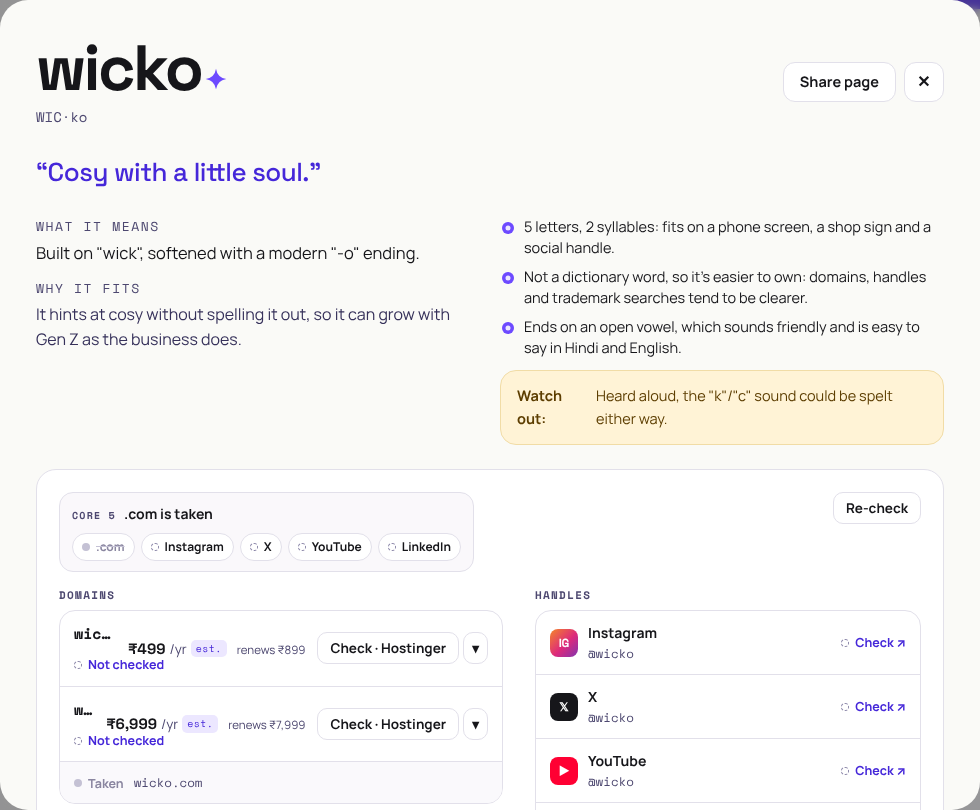
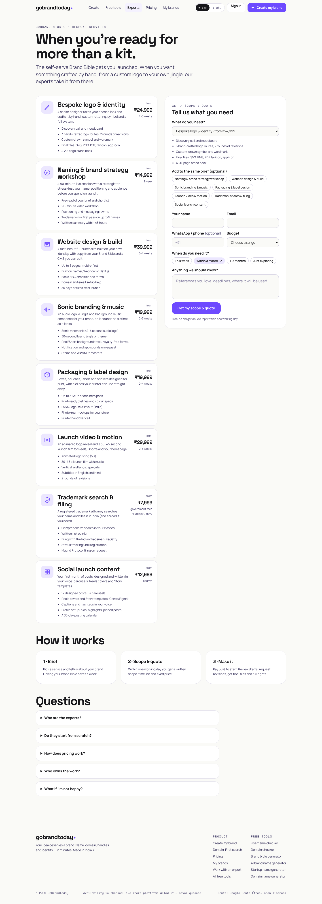

# gobrandtoday✦

**Your idea deserves a brand.** GoBrandToday takes someone from *“I have an idea but don’t know what to call it”* to a name, verified domain, social handles, a transparent score, a full visual identity and launch content in a few minutes.

**Idea → Name → Domain → Handles → GoBrand Score™ → Brand Bible → Launch kit**

India-first: ₹ pricing (switch to $), `.in` domains, Indian-language name roots, Hindi meaning checks and Indian registrar storefronts.

---

## What's inside

| | |
|---|---|
| **Two front doors** | “I have an idea” (AI naming, with optional quick filters: industry, name style, must-have domains, max length, starts-with) or “I have a name” (instant domain + handle + score check). |
| **10 naming modes** | Smart, Short & Punchy, Premium, Tech/AI, Invented, Human, Global, India-Inspired, SEO-Friendly, **Domain-First** (keeps only names whose domain is free). |
| **Conversational refinement** | Chips (“Shorter”, “More Indian”…) and plain-English feedback (“too corporate”), plus hard constraints: max length, starts-with and letters to avoid. ♥ saved names steer the next round. |
| **Real availability, with prices** | Domains via the registries' own **RDAP** (free, keyless), then a registrar (Name.com, Porkbun, GoDaddy, Namecheap or Hostinger) confirms it can actually be bought, with the real price. Registry-only answers say **Likely free**; prices without a live quote are labelled **est.** A **Core 5** tag shows .com, Instagram, X, YouTube and LinkedIn at a glance. Handles are verified where platforms allow it; elsewhere you get a one-tap “Check ↗” link. **Nothing is ever guessed.** |
| **GoBrand Score™** | 0–100 internally, shown /10, with 8 explained components, published weights, an SEO explanation and risk flags (unfortunate meanings in Hindi, Spanish, German and other languages, plus names one letter away from famous brands). |
| **Names with a story** | Each name comes with its meaning, a ready tagline, three concrete reasons it works and one honest watch-out. |
| **Shortlist & compare** | Select up to 4, check them all, and compare every factor side by side. The app does not pick a winner for you. |
| **Brand in a Box** | Meaning, story, positioning, mission, vision, audience, archetype, voice, taglines and messaging. |
| **Four looks, then a brand book** | Every brand is offered **four genuinely different looks**. They are built from ten constructions (symbol + wordmark, emblem, lettermark, Spark full stop, signet, editorial serif, sticker stack, bouncy letters, command line, Shirorekha), **13 generative symbol families** seeded by the name, and **symbols the AI draws as SVG** (sanitised). Each look has its own contrast-checked palette and Google Fonts pairing. Pick one and get a studio-style brand book: essence, logo system, clear space and minimum sizes, backgrounds, misuse, colour with HEX/RGB/CMYK, proportions and WCAG pairings, type scale, pattern, imagery (AI moodboard via free FLUX models), voice and UI, and **nine mockups** (business cards, app icon, social post, website, t-shirt, tote, cup, shop sign, packaging). |
| **Free tools** | Social media username checker, domain availability checker with prices, and brand bible generator, plus name-generator landing pages (good for SEO). |
| **Work with an expert** | A premium tier of bespoke services: hand-crafted logo and identity, naming workshop, website, **sonic branding and music**, packaging, launch video, trademark filing and social content. Fixed quotes in ₹ or $. |
| **Launch & website kit** | Instagram/X/LinkedIn/YouTube bios, launch posts, an X thread, 10 content ideas, and full homepage copy with a live preview. |
| **AI Brand Assistant** | “Make my tagline more premium”, “darker palette”, “10 alternatives”, “Instagram carousel”. Changes apply to the kit, are versioned, and can be undone. |
| **Export & share** | PDF guidelines, PNG/SVG logo, SVG app icon, JSON, Markdown; read-only share links; saved-name CSV/share. |
| **Accounts without friction** | Start instantly as a guest. Sign up (email/password or Google) and your work comes with you. |

---

## Quick start (local)

Requirements: **Node 20.11+** (22 recommended) and **PostgreSQL 14+**.

```bash
cd gobrandtoday
cp .env.example .env                 # works as-is for local dev
npm install

# Postgres — either use your own, or:
docker compose up -d db

npm run db:migrate                   # creates tables
npm run dev                          # API on :4000, web on :3000
```

Open <http://localhost:3000>. With no API keys, GoBrandToday runs on its **offline generator** (labelled “Offline generator” in the UI). Add `ANTHROPIC_API_KEY` (or `OPENAI_API_KEY`) to switch to real AI. Domain checks work immediately via RDAP.

| Script | What it does |
|---|---|
| `npm run dev` | API (tsx watch) + web (next dev) |
| `npm run build` / `npm start` | Production build / start both apps |
| `npm run db:migrate` | Apply SQL migrations (`apps/api/drizzle`) |
| `npm run db:generate` | Generate a new migration after editing `apps/api/src/db/schema.ts` |
| `npm test` | Unit tests (shared + API) and the API integration test (uses `DATABASE_URL`; set `SKIP_DB_TESTS=1` to skip) |
| `npm run typecheck` | TypeScript across all workspaces |

API docs (OpenAPI / Swagger UI): <http://localhost:4000/api/docs>.

## Try it without a server (preview build)

```bash
npm run preview:build        # → apps/web/preview/dist/{index.html, app.js, app.css}
```

This bundles the real pages and components with an in-browser stand-in for the API (`apps/web/preview/local-api.ts`), with data kept in the browser. Inside a Claude viewer it asks Claude (with the viewer's consent) for names, Brand Bibles, logo symbols and the assistant, using the same prompts and schemas as the server; elsewhere the offline engine answers. The sandbox can't reach registries, so domains and handles show prices and one-tap links, never a claimed status. It's handy for design reviews and stakeholder demos: open `index.html` from any static host.

## Demo mode

`DEMO_MODE=true` swaps domain and social checks for deterministic sample data. Every result is then marked **demo** and a banner explains it, so demo data can never be mistaken for a real check.

## Repository layout

```
gobrandtoday/
├── packages/shared/     # Types (zod), GoBrand Score engine, brand system (marks, palettes, fonts),
│                        # handle rules, pricing (INR/USD), registrar links. Used by API *and* web.
├── apps/api/            # Fastify + Drizzle/Postgres. Providers → services → routes.
│   ├── src/providers/   # ai/ (anthropic, openai, offline) · domain/ (rdap, namecom, porkbun, godaddy, hostinger, namecheap, mock)
│   │                    # image/ (pollinations, huggingface, cloudflare, together, openai)
│   │                    # social/ (github, reddit, youtube, manual, mock) · analytics/ · billing/
│   ├── src/services/    # naming, domain, social, brand (kit, assistant, versions), auth, usage
│   ├── src/routes/      # REST endpoints
│   └── drizzle/         # SQL migrations
├── apps/web/            # Next.js (App Router). Talks only to its own origin; /api/* is proxied to the API.
└── docs/                # Architecture, API, providers, deployment, limitations
```

## Documentation

- [docs/ARCHITECTURE.md](docs/ARCHITECTURE.md): system design, data model, request flows, extension points
- [docs/API.md](docs/API.md): every endpoint, with examples
- [docs/PROVIDERS.md](docs/PROVIDERS.md): setting up Anthropic/OpenAI, RDAP, GoDaddy, Hostinger, Namecheap, GitHub, YouTube, Google OAuth, PostHog
- [docs/DEPLOYMENT.md](docs/DEPLOYMENT.md): Docker, Render/Railway/Fly, Vercel + a Node host, plain VPS
- [docs/LIMITATIONS.md](docs/LIMITATIONS.md): known limitations and the roadmap of extension points

## Principles we kept

1. **Never fabricate availability.** Every domain and handle result carries its source (`rdap`, `godaddy`, `official_api`, `manual`, `demo`…) and a `verified` flag.
2. **Never hard-code a provider.** AI, domain, social, analytics and billing all sit behind interfaces chosen by env vars.
3. **Never expose a secret.** The browser only talks to its own origin; third-party calls happen server-side.
4. **Progressive disclosure.** One sentence first. Details, modes and constraints are there when you want them.

## Screenshots

These come from a real run in headless Chromium using the offline generator. In the sandbox where they were taken, outbound registry and social APIs were blocked, so some results read “Unverified”. That's the honest fallback working as designed.

| Landing | Idea + quick filters | Studio + shortlist |
|---|---|---|
|  |  |  |

| Pick one of four looks | Brand book: essence & logo | Brand in a Box |
|---|---|---|
|  |  |  |

| Applications (mockups) | Availability with prices & Core 5 | Name details |
|---|---|---|
|  |  |  |

| Work with an expert |
|---|
|  |
